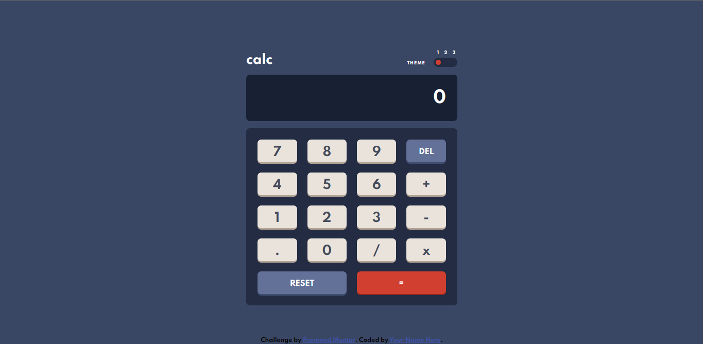
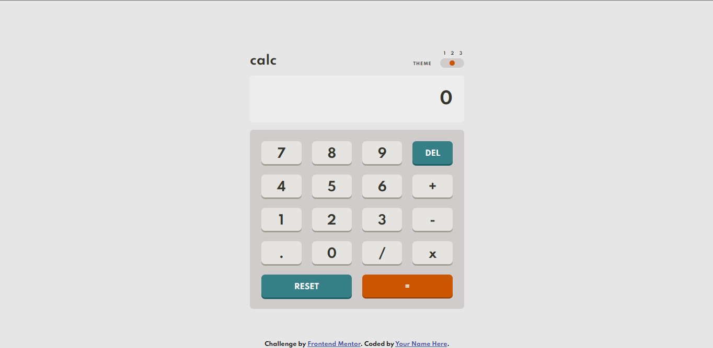
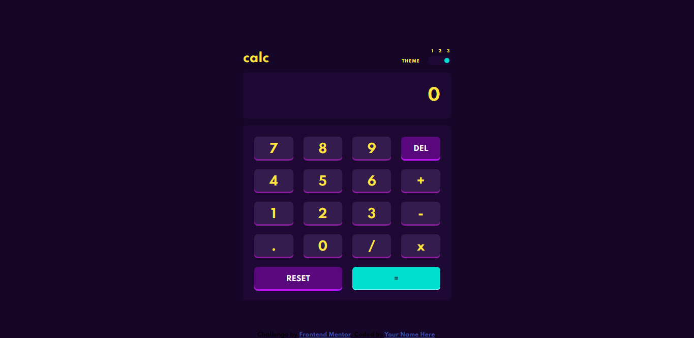
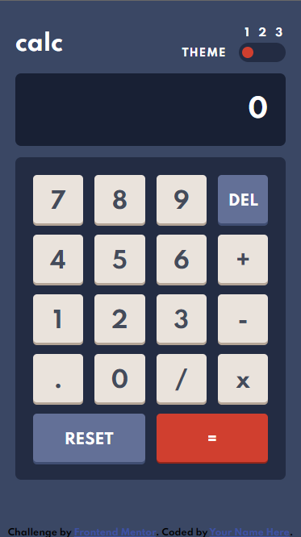
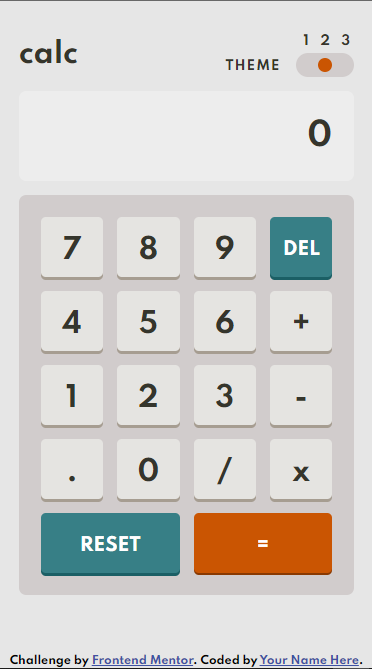
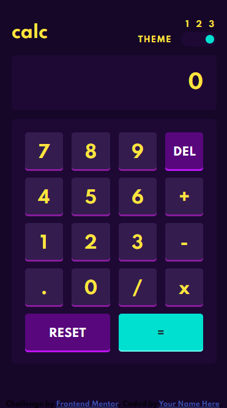

# Frontend Mentor - Calculator app solution

This is a solution to the [Calculator app challenge on Frontend Mentor](https://www.frontendmentor.io/challenges/calculator-app-9lteq5N29). Frontend Mentor challenges help you improve your coding skills by building realistic projects. 

## Table of contents

- [Overview](#overview)
  - [The challenge](#the-challenge)
  - [Screenshot](#screenshot)
  - [Links](#links)
- [My process](#my-process)
  - [Built with](#built-with)
  - [What I learned](#what-i-learned)
  - [Useful resources](#useful-resources)
- [Author](#author)
- [Acknowledgments](#acknowledgments)

## Overview

### The challenge

Users should be able to:

- See the size of the elements adjust based on their device's screen size
- Perform mathmatical operations like addition, subtraction, multiplication, and division
- Adjust the color theme based on their preference
- **Bonus**: Have their initial theme preference checked using `prefers-color-scheme` and have any additional changes saved in the browser

### Screenshot

## My process

### Built with

- Semantic HTML5 markup
- CSS custom properties
- Flexbox
- CSS Grid

### What I learned

I learned how to use make the change theme on a web page. I learned more about JS.

### Useful resources

- [Resource 1](https://www.w3schools.com/) - This helped me to use some functions on JS and some propertipes on css. I really liked this pattern and will use it going forward.
- [Resource 2](https://codepip.com/) - This is an amazing article which helped me finally understand some thing of flex propertipe. I'd recommend it to anyone still learning this concept.

## Author

- Frontend Mentor - [@TSdnl13](https://www.frontendmentor.io/profile/yourusername)

## Acknowledgments

I saw videos on youtube about creating web pages using html, css and js, that helped me a lot becasue I can use techniques to builds web pages, also i learned css and js on youtube, and i always searching for differents web pages to get inspired, I am constantly seeing how web pages are built on YouTube, I also check web pages that are on the web, such as portfolios.
